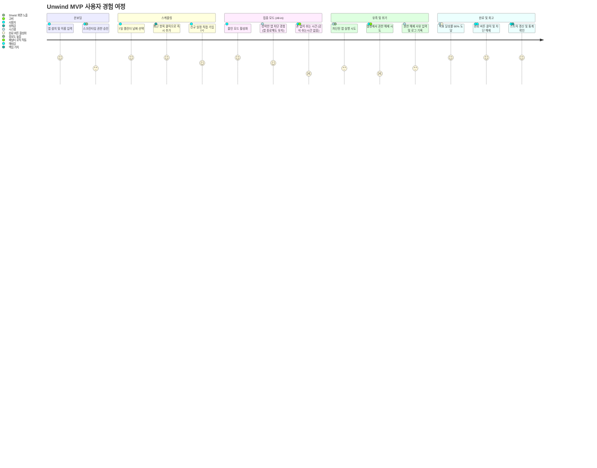

## 1. 📱 Unwind 고객 여정 지도 (User Journey Map)

| 단계 | 발견 및 온보딩 | 스케줄링 (Planning) | 집중 수행 (Lockdown) | 유혹 및 대응 | 완료 및 성취 |
| --- | --- | --- | --- | --- | --- |
| **사용자 행동** | 앱 설치 및 Screen Time 권한 승인 | 7일 캘린더 확인, 최근 항목/신규 추가로 일정 등록 | '개별' 또는 '올인' 모드 시작 | 차단 앱 실행 시도 또는 설정에서 권한 해제 시도 | 목표 달성률 도달 후 '완료' 클릭 |
| **터치포인트** | 권한 안내 화면 | 7일 스케줄러, 최근 항목 카드, `+` 버튼 | 잠금 화면(Shield), 진행률 인디케이터 | 커스텀 차단 화면, 패널티/사유 입력 팝업 | 완료 축하 팝업, 스트릭(Streak) 보드 |
| **사용자 감정** | 기대감 & 약간의 귀찮음 | 계획 수립의 뿌듯함 | **답답함 (고비)** → 몰입 | 갈등 & 저항 | **해방감 & 자존감 상승** |
| **핵심 가치** | 신뢰감 있는 권한 요청 | 최소한의 입력(30초 컷) | 강력한 강제성 (앱 종료 시에도 유지) | 정교한 패널티 및 로그 기록 | 스트릭을 통한 보상 루틴 |

---

## 2. 📊 Mermaid 형식의 고객 여정 다이어그램

Mermaid의 `journey` 형식을 사용하여 시각화했습니다. 이 코드는 Mermaid를 지원하는 에디터나 Notion 등에서 바로 렌더링할 수 있습니다.

---

## 3. 💡 결정적 순간(Moment of Truth)에 대한 UX 전략

### ① 스케줄링의 '귀찮음' 해결 (Planning Moment)

* **전략**: 사용자가 앱을 켜자마자 **"어제 했던 그 공부(최근 항목)"**가 하단에 바로 보이게 합니다. `+` 버튼을 누르기 전에 이미 눈앞에 대안을 제시함으로써 '생각하는 비용'을 줄여줍니다.

### ② 앱 종료 후 '당혹감' 해결 (Lockdown Moment)

* **전략**: 사용자가 습관적으로 Unwind 앱을 위로 날려(Kill) 종료했을 때, 여전히 다른 앱들이 잠겨 있으면 당황할 수 있습니다. 이때 차단 화면(Shield)에서 **"앱이 꺼져도 집중은 계속됩니다. Unwind는 당신의 의지를 지킵니다."**라는 문구를 보여주어 '오류'가 아닌 '기능'임을 인지시킵니다.

### ③ 유혹의 순간 '패널티' 처리 (Crisis Moment)

* **전략**: 단순히 스트릭을 깎는 것이 아니라, **"지금 포기하면 어제까지의 노력이 사라집니다"**라는 문구와 함께 **'사유 선택'** 단계를 넣습니다. 사용자가 "그냥 심심해서" 같은 사유를 직접 체크하게 함으로써 스스로 부끄러움을 느끼게 유도(Nudge)합니다.

---
