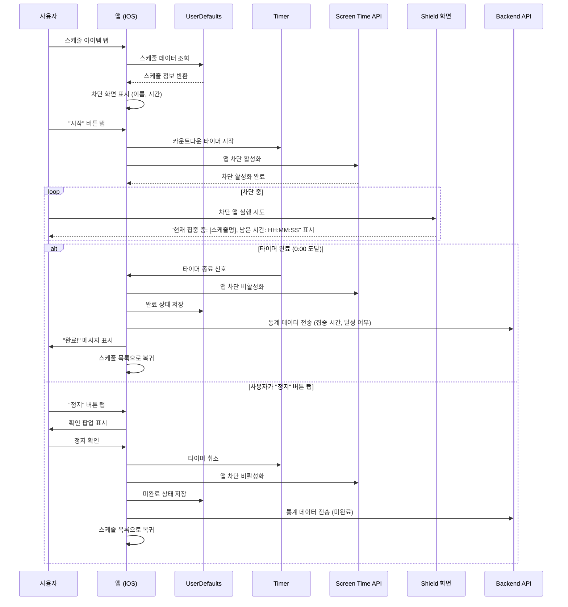
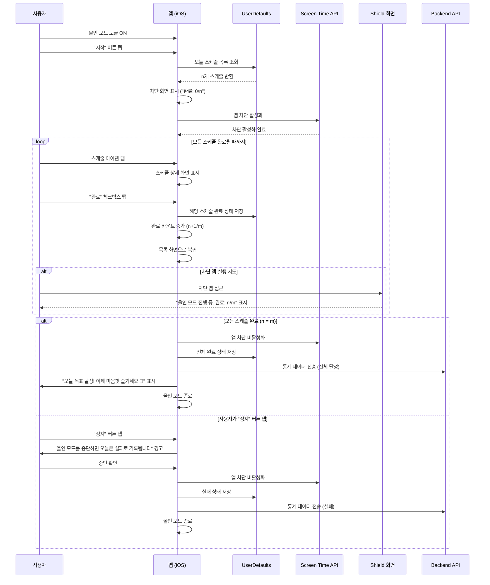
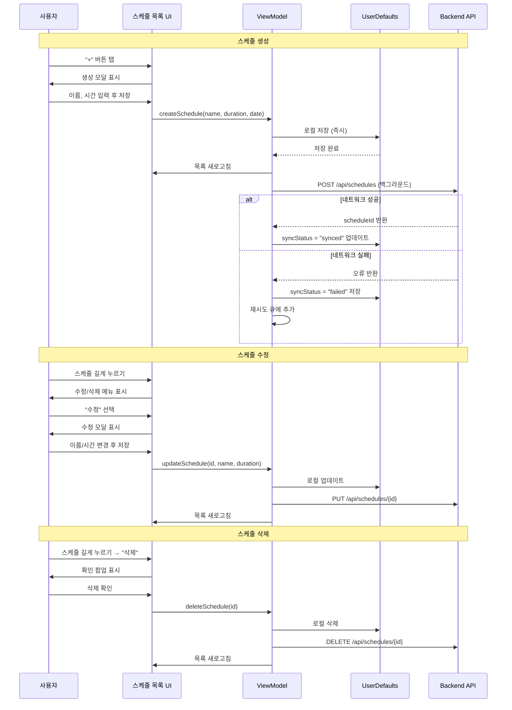
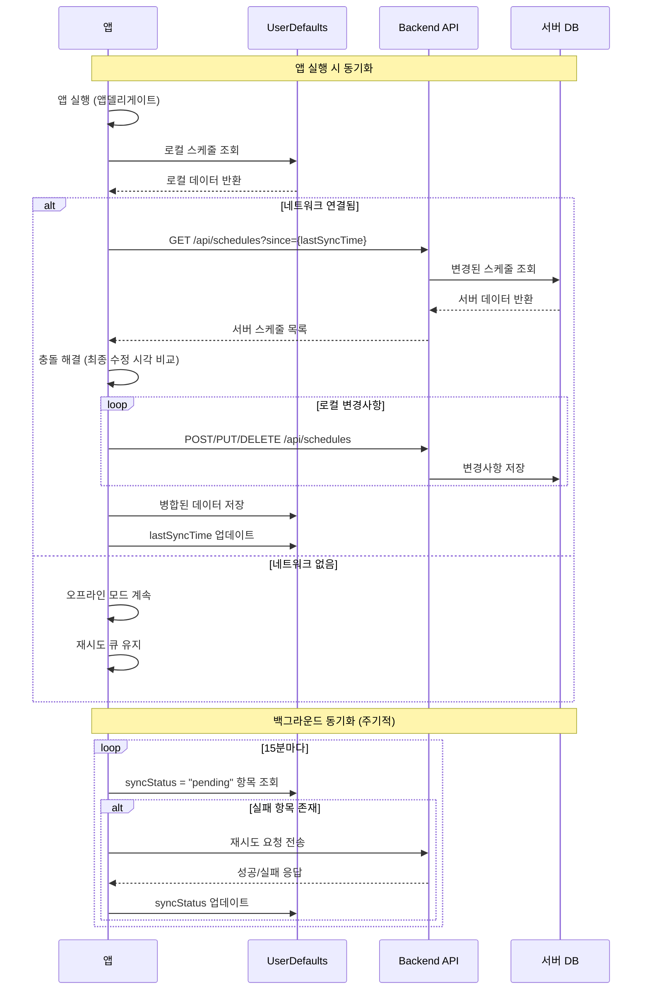
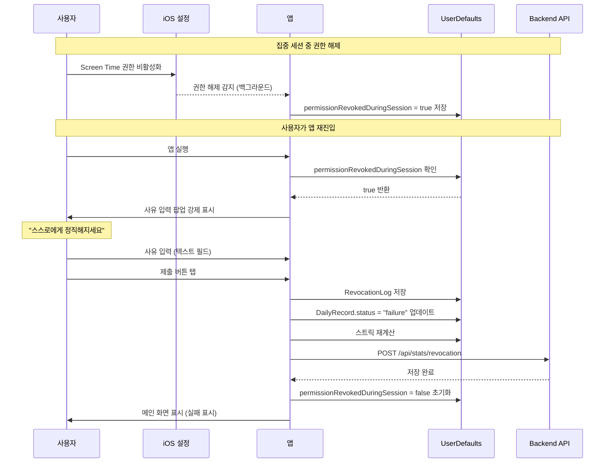
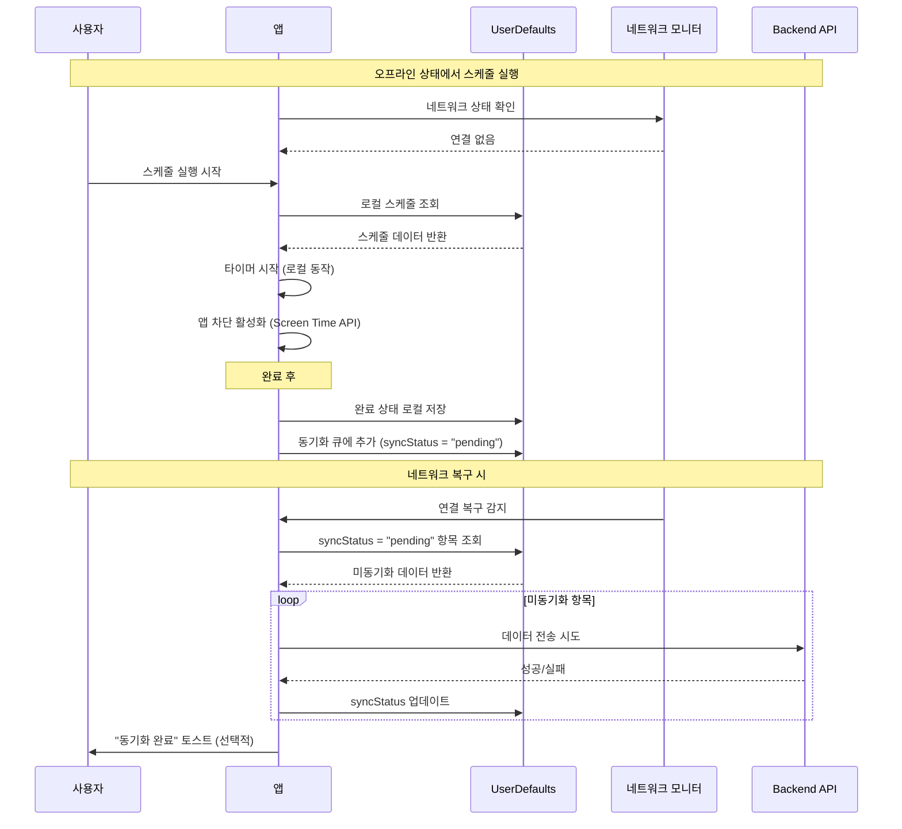

# 소프트웨어 요구사항 명세서 (SRS)

**문서 번호:** SRS-001  
**버전:** 1.0  
**작성일:** 2025년 12월 29일  
**준수 표준:** ISO/IEC/IEEE 29148:2018  
**프로젝트명:** Unwind - 집중력 향상 앱

---

## 1. 개요

### 1.1 목적

본 소프트웨어 요구사항 명세서(SRS)는 **Unwind** iOS 애플리케이션의 완전한 기능적, 비기능적, 인터페이스 및 데이터 요구사항을 정의합니다. Unwind는 스마트폰 중독 문제를 해결하기 위해 시스템 레벨의 앱 차단 기능을 제공하여, 사용자가 계획한 일과를 완수하고 죄책감 없는 휴식을 즐길 수 있도록 지원하는 집중력 향상 애플리케이션입니다.

**해결하는 문제:**
- 스마트폰 중독으로 인한 계획된 일과 미완수
- 일도 못 끝내고 쉬어도 죄책감이 드는 악순환
- 기존 앱 차단 솔루션의 높은 우회율 (>60%)

**주요 목표:**
- **1차 목표**: 강력한 시스템적 제약으로 실제 집중 시간 확보
- **2차 목표**: 목표 달성 후 죄책감 없는 휴식 제공
- **정량 목표**: 일일 집중 시간 1.2시간 → 2.5시간, 스케줄 완전 달성률 40% → 75%

### 1.2 범위

#### 범위 내 (In-Scope)

**MVP (v1.0) 포함 기능:**
- iOS 네이티브 애플리케이션 (iOS 16.0+, iPhone + iPad 지원)
- 스케줄 CRUD 기능 (7일 뷰, 최근 항목 빠른 추가)
- 개별 스케줄 실행 모드 (타이머 기반 앱 차단)
- 올인 모드 (하루 전체 스케줄 완료 시까지 차단)
- 차단 앱 커스텀 설정 (Screen Time API 사용)
- 스트릭 추적 및 성공률 통계
- 권한 해제 패널티 시스템 (사유 기록)
- 완료 축하 메시지
- 사용자 인증 시스템 (회원가입/로그인)
- 서버 기반 데이터 동기화 (스케줄, 통계)
- 로컬 데이터 저장 (UserDefaults - 오프라인 지원)
- 사용자별 통계 데이터 서버 전송 (달성 빈도, 집중 시간, 강제 종료 수)

#### 범위 외 (Out-of-Scope)

**MVP (v1.0) 제외 항목:**

| 기능 | 제외 사유 | 포함 예정 버전 |
|------|----------|--------------|
| Apple 캘린더 연동 | API 통합 복잡도 | v1.1 (2025 Q2) |
| Android 플랫폼 지원 | 리소스 제약 | v2.0 (TBD) |
| 소셜 기능 (친구, 리더보드) | 핵심 가치 검증 우선 | v1.2 (TBD) |
| 결제/구독 시스템 | 무료 모델 검증 후 도입 | v1.3 (TBD) |

### 1.3 용어 정의

| 용어 | 정의 |
|------|------|
| **올인 모드 (All-in Mode)** | 스케줄 사이 쉬는 시간 없이 하루 전체를 잠그는 집중 모드. 모든 스케줄 완료 시까지 차단 해제 불가 |
| **개별 스케줄 실행 (Individual Schedule Execution)** | 각 스케줄을 개별로 실행하여 설정된 시간만큼만 앱을 차단하는 모드 |
| **Shield** | 차단된 앱 실행 시 iOS 시스템이 표시하는 커스텀 화면 (ShieldConfiguration API 사용) |
| **스트릭 (Streak)** | 연속 성공 일수. 계획 없는 날은 스트릭 유지 |
| **최근 항목 (Recent Items)** | 최근 7일 내 사용한 스케줄을 빠르게 재사용하는 기능 |
| **CRUD** | Create(생성), Read(조회), Update(수정), Delete(삭제) 작업 |
| **동기화 (Sync)** | 로컬 데이터와 서버 데이터 간 일치성 유지 작업 |
| **오프라인 모드 (Offline Mode)** | 네트워크 연결 없이 앱의 핵심 기능을 사용할 수 있는 상태 |

### 1.4 참조 문서

| 문서 ID | 문서명 | 설명 |
|---------|--------|------|
| REF-01 | unwind_prd.md | 제품 요구사항 문서 (원본 비즈니스 요구사항) |
| REF-02 | ISO/IEC/IEEE 29148:2018 | 시스템 및 소프트웨어 공학 — 요구사항 공학 표준 |
| REF-03 | Apple FamilyControls Framework | Screen Time API 공식 문서 |
| REF-04 | Apple ShieldConfiguration | 차단 화면 커스터마이징 API 문서 |
| REF-05 | Spring Boot Documentation | 백엔드 프레임워크 참조 문서 |

---

## 2. 이해관계자

| 역할 | 책임 | 관심사 |
|------|------|--------|
| **최종 사용자 (대학생)** | 앱을 사용하여 학업 스케줄 관리 | 과제 완수, 방해 없는 집중 환경, 완료 후 죄책감 없는 휴식 |
| **최종 사용자 (시험 준비생)** | 오전/오후 학습 세션 실행 | 학습 계획의 강력한 강제성, 저녁 여가 시간의 심리적 안정 |
| **제품 책임자 (Product Owner)** | 제품 비전 및 우선순위 정의 | 75% 일일 달성률, 50% 30일 리텐션 목표 달성 |
| **개발팀 (iOS)** | iOS 앱 구현 및 유지보수 | 명확하고 테스트 가능한 요구사항, 기술적 실현 가능성 |
| **개발팀 (Backend)** | Spring Boot 서버 구현 및 API 제공 | RESTful API 명세, 데이터베이스 스키마, 성능 요구사항 |
| **QA 팀** | 시스템 동작 검증 | 측정 가능한 인수 기준, 테스트 케이스 추적성 |
| **Apple 앱스토어 심사자** | 앱 배포 승인 | Screen Time API 사용 정당성, 개인정보 보호 준수 |
| **인프라 엔지니어** | 서버 운영 및 모니터링 | 시스템 안정성, 확장성, 비용 효율성 |

---

## 3. 시스템 컨텍스트 및 인터페이스

### 3.1 외부 시스템

| 시스템 | 인터페이스 타입 | 목적 |
|--------|---------------|------|
| **iOS Screen Time API** | FamilyControls Framework | 앱 차단 강제 실행, 모니터링 |
| **iOS System Timer** | DispatchSourceTimer | 개별 스케줄 카운트다운 타이머 |
| **UserDefaults** | 로컬 키-값 저장소 | 스케줄 데이터 로컬 저장 (오프라인 지원) |
| **Spring Boot Backend** | RESTful API (HTTPS) | 사용자 인증, 스케줄 동기화, 통계 수집 |
| **관계형 데이터베이스** | JDBC (TBD: MySQL/PostgreSQL) | 서버 측 영구 데이터 저장 |

### 3.2 클라이언트 애플리케이션

**플랫폼:** iOS 네이티브 애플리케이션 (Swift/SwiftUI)

**최소 요구사항:**
- iOS 16.0 이상
- iPhone 8 이상 또는 iPad (5세대 이상)
- 50 MB 사용 가능 저장 공간
- 인터넷 연결 (최초 인증 및 동기화 시 필요, 이후 선택적)

### 3.3 API 개요

#### 내부 API (로컬)
- **스케줄 관리 API**: CRUD 작업
- **집중 세션 관리 API**: 시작/중지/모니터링
- **통계 API**: 스트릭 계산, 성공률 산출
- **동기화 API**: 로컬↔서버 데이터 동기화

#### 외부 API (iOS)
- `FamilyControls.requestAuthorization()`: Screen Time 권한 요청
- `DeviceActivityMonitor` 확장: 백그라운드 모니터링
- `ShieldConfiguration` 제공자: 차단 화면 커스터마이징

#### 백엔드 API (Spring Boot)
- **인증 API**: 회원가입, 로그인, 토큰 갱신
- **스케줄 API**: 스케줄 CRUD, 동기화
- **통계 API**: 사용자별 통계 데이터 수집 및 조회
- **사용자 API**: 프로필 관리

### 3.4 상호작용 시퀀스

#### 핵심 시퀀스 1: 개별 스케줄 실행 흐름



#### 핵심 시퀀스 2: 올인 모드 실행 흐름



---

## 4. 구체적 요구사항

### 4.1 기능 요구사항

| 요구사항 ID | 출처 | 설명 | 우선순위 | 인수 기준 |
|------------|------|------|---------|-----------|
| **REQ-FUNC-001** | Story 1 | 시스템은 사용자가 새로운 스케줄을 생성할 수 있어야 함 | Must | **Given** 사용자가 "+" 버튼을 탭할 때<br>**When** 스케줄 생성 모달이 나타나면<br>**Then** 이름과 시간을 입력하고 저장 시 UserDefaults와 서버에 저장됨 |
| **REQ-FUNC-002** | Story 1 | 시스템은 최근 사용한 스케줄을 빠르게 추가할 수 있는 기능을 제공해야 함 | Should | **Given** 사용자가 스케줄 생성 모달을 열 때<br>**When** "최근 항목" 탭을 선택하면<br>**Then** 최근 7일 내 사용한 스케줄 목록이 표시되어 선택 가능함 |
| **REQ-FUNC-003** | Story 1 | 시스템은 7일간의 날짜 탭 내비게이션을 제공해야 함 | Must | **Given** 사용자가 스케줄 홈 화면에 있을 때<br>**When** 날짜 탭을 좌우로 스와이프하면<br>**Then** 선택된 날짜의 스케줄 목록으로 업데이트됨 |
| **REQ-FUNC-004** | Story 1 | 시스템은 길게 누르기를 통한 스케줄 수정 기능을 제공해야 함 | Must | **Given** 사용자가 스케줄 아이템을 길게 누를 때<br>**When** 수정 옵션을 선택하면<br>**Then** 수정 모달이 나타나고 이름/시간 변경 후 저장 시 즉시 반영됨 |
| **REQ-FUNC-005** | Story 1 | 시스템은 확인 절차를 거쳐 스케줄을 삭제할 수 있어야 함 | Must | **Given** 사용자가 스케줄 아이템을 길게 누를 때<br>**When** 삭제 옵션을 선택하고 확인 팝업에서 확인하면<br>**Then** 스케줄이 목록과 로컬/서버에서 제거됨 |
| **REQ-FUNC-006** | Story 2 | 시스템은 타이머 기반 개별 스케줄 실행 기능을 제공해야 함 | Must | **Given** 사용자가 스케줄 아이템을 탭할 때<br>**When** 차단 화면에서 스케줄 이름과 시간이 표시되면<br>**Then** "시작" 버튼이 카운트다운과 앱 차단을 시작함 |
| **REQ-FUNC-007** | Story 2 | 시스템은 개별 스케줄 실행 중 차단 앱 접근 시 Shield 화면을 표시해야 함 | Must | **Given** 개별 스케줄로 앱 차단이 활성화되었을 때<br>**When** 사용자가 차단된 앱을 실행하려 하면<br>**Then** Shield 화면에 "현재 집중 중: [스케줄명], 남은 시간: HH:MM:SS" 표시 |
| **REQ-FUNC-008** | Story 2 | 시스템은 개별 스케줄의 수동 정지 기능을 제공해야 함 | Must | **Given** 개별 스케줄 타이머가 실행 중일 때<br>**When** 사용자가 "정지"를 탭하고 확인하면<br>**Then** 타이머 취소, 차단 비활성화, 미완료로 표시, 목록 복귀 |
| **REQ-FUNC-009** | Story 2 | 시스템은 타이머 완료 시 자동으로 스케줄을 완료 처리해야 함 | Must | **Given** 개별 스케줄 타이머가 0:00에 도달할 때<br>**When** 타이머가 종료되면<br>**Then** 차단 비활성화, "완료!" 메시지, 완료 상태 저장, 목록 복귀 |
| **REQ-FUNC-010** | Story 3 | 시스템은 하루 전체 스케줄을 위한 올인 모드를 제공해야 함 | Must | **Given** 사용자가 올인 모드를 ON하고 "시작"을 탭할 때<br>**When** 앱 차단이 활성화되면<br>**Then** "모든 일정 완료 시까지 차단됩니다" 메시지와 전체 개수 표시 |
| **REQ-FUNC-011** | Story 3 | 시스템은 올인 모드 중 개별 스케줄 완료 체크 기능을 제공해야 함 | Must | **Given** 올인 모드가 활성화되었을 때<br>**When** 사용자가 스케줄을 탭하고 상세에서 "완료" 체크하면<br>**Then** 완료 상태 저장, 카운트 증가 (n+1/m), 목록 복귀 |
| **REQ-FUNC-012** | Story 3 | 시스템은 올인 모드 중 차단 앱 접근 시 진행 상황을 표시해야 함 | Must | **Given** 올인 모드가 활성화되었을 때<br>**When** 사용자가 차단된 앱을 실행하려 하면<br>**Then** Shield 화면에 "올인 모드 진행 중. 완료: n/m" 표시 |
| **REQ-FUNC-013** | Story 3 | 시스템은 올인 모드의 모든 스케줄 완료 시 차단을 해제해야 함 | Must | **Given** 올인 모드에서 n/m 스케줄 중일 때<br>**When** 마지막 스케줄이 완료되면 (n=m)<br>**Then** 축하 메시지, 차단 비활성화, 올인 모드 종료 |
| **REQ-FUNC-014** | Story 3 | 시스템은 올인 모드 중단 시 경고 및 실패 기록 기능을 제공해야 함 | Must | **Given** 올인 모드가 활성화되었을 때<br>**When** 사용자가 "정지"를 탭하고 경고 확인하면<br>**Then** 해당 일자 실패 표시, 차단 비활성화, 올인 모드 종료 |
| **REQ-FUNC-015** | Story 4 | 시스템은 차단할 앱을 사용자가 설정할 수 있어야 함 | Must | **Given** 사용자가 설정 → "차단할 앱 관리"로 이동할 때<br>**When** 기기 앱 목록이 체크박스와 함께 표시되면<br>**Then** 체크/해제 후 "저장" 시 로컬에 설정 저장 |
| **REQ-FUNC-016** | Story 4 | 시스템은 앱 버전 정보를 표시해야 함 | Must | **Given** 사용자가 설정 화면에 있을 때<br>**When** 화면이 로드되면<br>**Then** 하단에 앱 버전 (예: "v1.0.0") 표시 |
| **REQ-FUNC-017** | Story 5 | 시스템은 권한 해제 시 사유 입력을 강제해야 함 | Should | **Given** 집중 세션 중 Screen Time 권한이 해제되었을 때<br>**When** 사용자가 앱에 재진입하면<br>**Then** "스스로에게 정직해지세요" 메시지와 함께 사유 입력 팝업 강제 표시 |
| **REQ-FUNC-018** | Story 5 | 시스템은 권한 해제 사유 제출 시 해당 일자를 경고/실패로 표시해야 함 | Should | **Given** 사용자가 권한 해제 사유를 입력할 때<br>**When** 사유를 제출하면<br>**Then** 해당 날짜 실패 표시, 스트릭 상태 업데이트, 서버 전송 |
| **REQ-FUNC-019** | Story 6 | 시스템은 메인 화면에 현재 스트릭을 표시해야 함 | Should | **Given** 사용자가 앱을 열 때<br>**When** 메인 화면이 로드되면<br>**Then** 상단에 현재 스트릭 (예: "🔥 7일 연속 달성") 표시 |
| **REQ-FUNC-020** | Story 6 | 시스템은 주간/월간 통계를 그래프로 제공해야 함 | Should | **Given** 사용자가 통계 탭으로 이동할 때<br>**When** 탭이 로드되면<br>**Then** 주간/월간 달성률 그래프와 최근 7일 활동 표시 |
| **REQ-FUNC-021** | 예외 처리 | 시스템은 데이터베이스 쓰기 실패 시 재시도 옵션을 제공해야 함 | Should | **Given** 로컬/서버 저장 중 오류 발생 시<br>**When** 오류가 감지되면<br>**Then** "저장 실패. 다시 시도하시겠습니까?" 팝업 표시 |
| **REQ-FUNC-022** | 예외 처리 | 시스템은 Screen Time 권한 거부 시 안내 및 설정 이동 기능을 제공해야 함 | Should | **Given** Screen Time 권한이 거부되었을 때<br>**When** 앱 실행 시<br>**Then** 권한 필요성 설명 + "설정으로 이동" 버튼 제공 |
| **REQ-FUNC-023** | 예외 처리 | 시스템은 타이머 실행 중 크래시 시 복구 기능을 제공해야 함 | Could | **Given** 타이머 실행 중 앱 크래시 발생 시<br>**When** 앱 재실행되면<br>**Then** 남은 시간 복원 또는 "세션이 중단되었습니다" 안내 |
| **REQ-FUNC-024** | 인증 | 시스템은 사용자 회원가입 기능을 제공해야 함 | Must | **Given** 신규 사용자가 앱을 처음 실행할 때<br>**When** 회원가입 화면에서 이메일/비밀번호 입력하면<br>**Then** 서버에 계정 생성 및 자동 로그인 처리 |
| **REQ-FUNC-025** | 인증 | 시스템은 사용자 로그인 기능을 제공해야 함 | Must | **Given** 기존 사용자가 앱을 실행할 때<br>**When** 로그인 화면에서 이메일/비밀번호 입력하면<br>**Then** 서버 인증 후 액세스 토큰 발급 및 저장 |
| **REQ-FUNC-026** | 동기화 | 시스템은 앱 실행 시 스케줄 데이터를 서버와 동기화해야 함 | Must | **Given** 사용자가 로그인된 상태로 앱을 실행할 때<br>**When** 네트워크 연결이 가능하면<br>**Then** 서버의 최신 스케줄을 가져와 로컬(UserDefaults)과 병합 |
| **REQ-FUNC-027** | 동기화 | 시스템은 스케줄 변경 시 서버에 자동 동기화해야 함 | Must | **Given** 사용자가 스케줄을 생성/수정/삭제할 때<br>**When** 네트워크 연결이 가능하면<br>**Then** 즉시 서버에 변경사항 전송, 실패 시 로컬 큐에 저장 |
| **REQ-FUNC-028** | 오프라인 | 시스템은 네트워크 없이도 핵심 기능이 동작해야 함 | Must | **Given** 네트워크 연결이 없을 때<br>**When** 사용자가 스케줄 실행/올인 모드를 사용하면<br>**Then** 로컬 데이터(UserDefaults)로 정상 동작, 동기화는 연결 복구 시 자동 재시도 |
| **REQ-FUNC-029** | 통계 전송 | 시스템은 스케줄 완료 시 통계 데이터를 서버에 전송해야 함 | Must | **Given** 스케줄이 완료되거나 중단될 때<br>**When** 네트워크 연결이 가능하면<br>**Then** 사용자 ID, 달성 여부, 집중 시간을 서버에 전송 |
| **REQ-FUNC-030** | 통계 전송 | 시스템은 앱 강제 종료 횟수를 카운트하고 서버에 전송해야 함 | Should | **Given** 사용자가 집중 세션 중 앱을 강제 종료할 때<br>**When** 앱이 재실행되면<br>**Then** 강제 종료 이벤트를 감지하고 서버에 카운트 전송 |

### 4.2 비기능 요구사항

| 요구사항 ID | 카테고리 | 설명 | 측정 기준 |
|------------|---------|------|-----------|
| **REQ-NF-001** | 성능 | Shield 화면 표시 지연 시간 | 차단 앱 실행 시도 후 Shield 화면 노출 ≤ 0.5초 (p95) |
| **REQ-NF-002** | 성능 | 스케줄 CRUD 작업 응답 시간 | 사용자 액션 후 UI 업데이트 완료 ≤ 0.3초 (p95) |
| **REQ-NF-003** | 성능 | 타이머 정확도 | 1시간 동작 시 오차 ≤ 2초 |
| **REQ-NF-004** | 신뢰성 | 재부팅 후 앱 차단 유지율 | 기기 재시작 후 차단 상태 유지 ≥ 95% |
| **REQ-NF-005** | 신뢰성 | 앱 강제 종료 후 차단 유지율 | 앱 강제 종료 후 차단 상태 유지 = 100% |
| **REQ-NF-006** | 사용성 | 스케줄 설정 완료 시간 | 사용자의 80% 이상이 30초 이내에 스케줄 설정 완료 |
| **REQ-NF-007** | 사용성 | 스케줄 CRUD 작업 성공률 | CRUD 시도의 98% 이상이 오류 없이 성공 |
| **REQ-NF-008** | 보안 | 로컬 데이터 저장 | 스케줄, 통계, 차단 앱 목록은 UserDefaults에 암호화 없이 저장 (민감 정보 아님) |
| **REQ-NF-009** | 보안 | Screen Time 권한 데이터 | 권한 데이터는 기기 내부에서만 처리, 외부 전송 금지 |
| **REQ-NF-010** | 프라이버시 | 개인 스케줄 내용 전송 | 스케줄 이름, 시간은 사용자별로 서버 전송 (암호화된 HTTPS 통신) |
| **REQ-NF-011** | 접근성 | VoiceOver 지원 | 모든 UI 요소에 설명적 레이블 제공, VoiceOver로 접근 가능 |
| **REQ-NF-012** | 접근성 | Dynamic Type 지원 | iOS Dynamic Type 설정에 따라 텍스트 크기 정상 조절 |
| **REQ-NF-013** | KPI | 일일 스케줄 완전 달성률 | 기준선 40% → 목표 75% (3개월 내) |
| **REQ-NF-014** | KPI | 7일 스트릭 유지율 | 기준선 30% → 목표 60% (3개월 내) |
| **REQ-NF-015** | KPI | 앱 차단 우회율 | 기준선 60% → 목표 15% (3개월 내) |
| **REQ-NF-016** | KPI | 30일 리텐션율 | 기준선 25% → 목표 50% (3개월 내) |
| **REQ-NF-017** | 네트워크 | API 응답 시간 | 백엔드 API 응답 시간 ≤ 500ms (p95) |
| **REQ-NF-018** | 네트워크 | 동기화 실패 시 재시도 | 네트워크 오류 시 최대 3회 자동 재시도 (지수 백오프) |
| **REQ-NF-019** | 확장성 | 스케줄 저장 제한 | 사용자당 최대 100개 스케줄 저장 가능 (초과 시 경고) |
| **REQ-NF-020** | 유지보수성 | 로그 수준 | 프로덕션 환경에서 ERROR 이상 로그만 기록 (디버그 로그 제외) |

---

## 5. 추적성 매트릭스

| Story ID | Story 명 | 요구사항 ID | 테스트 케이스 ID | 우선순위 |
|----------|---------|-----------|----------------|---------|
| Story 1 | 스케줄 CRUD | REQ-FUNC-001, 002, 003, 004, 005 | TC-001 ~ TC-010 | Must |
| Story 2 | 개별 스케줄 실행 | REQ-FUNC-006, 007, 008, 009 | TC-011 ~ TC-018 | Must |
| Story 3 | 올인 모드 | REQ-FUNC-010, 011, 012, 013, 014 | TC-019 ~ TC-027 | Must |
| Story 4 | 차단 앱 설정 | REQ-FUNC-015, 016 | TC-028 ~ TC-032 | Must |
| Story 5 | 권한 해제 패널티 | REQ-FUNC-017, 018 | TC-033 ~ TC-036 | Should |
| Story 6 | 스트릭 & 통계 | REQ-FUNC-019, 020 | TC-037 ~ TC-040 | Should |
| 인증 | 사용자 인증 | REQ-FUNC-024, 025 | TC-041 ~ TC-044 | Must |
| 동기화 | 데이터 동기화 | REQ-FUNC-026, 027, 028 | TC-045 ~ TC-050 | Must |
| 통계 전송 | 서버 통계 | REQ-FUNC-029, 030 | TC-051 ~ TC-054 | Must |
| 예외 처리 | 에러 핸들링 | REQ-FUNC-021, 022, 023 | TC-055 ~ TC-060 | Should |
| KPI-01 | 일일 달성률 | REQ-NF-013 | TC-061 | Must |
| KPI-02 | 스트릭 유지율 | REQ-NF-014 | TC-062 | Must |
| KPI-03 | 우회율 | REQ-NF-015 | TC-063 | Must |
| 성능 | 응답 시간 | REQ-NF-001, 002, 003, 017 | TC-064 ~ TC-067 | Must |
| 신뢰성 | 차단 지속성 | REQ-NF-004, 005 | TC-068, TC-069 | Must |

---

## 6. 가정사항 및 제약사항

### 6.1 가정사항 (Assumptions)

| ID | 가정사항 | 영향 범위 | 검증 시점 |
|----|---------|----------|----------|
| **ASM-001** | iOS 16.0 이상의 Screen Time API가 안정적으로 동작함 | 앱 차단 핵심 기능 | 개발 초기 단계 |
| **ASM-002** | 사용자는 최초 실행 시 Screen Time 권한을 부여함 | 온보딩 프로세스 | 베타 테스트 |
| **ASM-003** | 사용자 기기는 최소 50MB 이상의 저장 공간을 보유함 | 앱 설치 및 데이터 저장 | 앱스토어 최소 요구사항 |
| **ASM-004** | 대부분의 사용자는 하루 3~10개의 스케줄을 생성함 | UserDefaults 용량 설계 | 베타 사용 데이터 분석 |
| **ASM-005** | 네트워크 연결은 간헐적이며, 오프라인 시간이 존재함 | 동기화 로직 설계 | 필드 테스트 |
| **ASM-006** | 백엔드 API는 95% 이상의 가용성을 유지함 | 동기화 신뢰성 | 인프라 모니터링 |
| **ASM-007** | 사용자는 이메일/비밀번호 기반 인증을 선호함 | 인증 방식 선택 | 사용자 리서치 |
| **ASM-008** | 통계 데이터 전송은 실시간이 아닌 배치 처리 가능 | 서버 부하 설계 | 성능 테스트 |
| **ASM-009** | iPad 사용자는 iPhone 사용자와 동일한 UI/UX를 수용함 | 반응형 디자인 범위 | UI/UX 테스트 |
| **ASM-010** | Apple 앱스토어 심사는 Screen Time API 사용 목적을 승인함 | 배포 가능성 | 앱스토어 제출 전 |

### 6.2 제약사항 (Constraints)

#### 6.2.1 기술적 제약사항

| ID | 제약사항 | 상세 설명 | 대응 방안 |
|----|---------|----------|----------|
| **CON-001** | iOS 플랫폼 전용 | Screen Time API는 iOS에서만 제공됨 | Android는 별도 프로젝트로 분리 (v2.0 이후) |
| **CON-002** | Screen Time API 제한 | FamilyControls 프레임워크는 특정 사용 사례만 허용 | 앱스토어 심사 시 "집중력 향상" 목적 명시 |
| **CON-003** | UserDefaults 용량 제한 | UserDefaults는 대용량 데이터 저장 부적합 (권장: <1MB) | 스케줄당 최대 100개 제한, 초과 시 서버 의존 |
| **CON-004** | 백그라운드 실행 제한 | iOS는 백그라운드 작업 시간 제한 (약 30초) | DeviceActivityMonitor 확장 활용 (시스템 레벨 동작) |
| **CON-005** | 네트워크 의존성 | 최초 인증 및 동기화는 네트워크 필수 | 오프라인 우선 설계, 연결 복구 시 자동 동기화 |
| **CON-006** | HTTPS 통신 필수 | iOS App Transport Security 정책 준수 | 백엔드 API는 반드시 HTTPS 제공 |
| **CON-007** | 데이터베이스 미정 | 백엔드 DB는 추후 결정 (MySQL/PostgreSQL) | Spring Boot JPA 사용으로 DB 독립성 확보 |
| **CON-008** | 클라우드 환경 미정 | AWS/Azure/GCP 선택 미정 | Docker 컨테이너화로 클라우드 중립성 유지 |

#### 6.2.2 비즈니스 제약사항

| ID | 제약사항 | 상세 설명 | 대응 방안 |
|----|---------|----------|----------|
| **CON-009** | MVP 출시 일정 | 구체적 출시 일정 미확정 (TBD) | 애자일 스프린트 단위 개발 (2주 단위) |
| **CON-010** | 예산 제약 | 인프라 비용 상한선 미정 | 서버리스 아키텍처 고려 (비용 최소화) |
| **CON-011** | 팀 규모 | iOS/백엔드 개발자 인원 미확정 | 핵심 기능 우선 개발, 점진적 확장 |
| **CON-012** | 초기 사용자 규모 | DAU 목표 미설정 | 소규모 베타 테스트 → 점진적 확장 |
| **CON-013** | 수익 모델 부재 | MVP는 무료 버전, 수익화 전략 부재 | v1.1 이후 프리미엄 기능 검토 |

#### 6.2.3 법적/규정 제약사항

| ID | 제약사항 | 상세 설명 | 대응 방안 |
|----|---------|----------|----------|
| **CON-014** | Apple 앱스토어 정책 | Screen Time API 사용 목적 심사 | 개인정보 보호 방침 작성, 사용 목적 명확히 기술 |
| **CON-015** | 개인정보보호법 준수 | 한국 개인정보보호법 준수 필요 (사용자 동의, 데이터 처리) | 개인정보 처리방침 작성, 사용자 동의 절차 구현 |
| **CON-016** | GDPR 고려 | 글로벌 출시 시 GDPR 준수 필요 (EU 사용자) | MVP는 한국 사용자 대상, 글로벌 확장 시 대응 |
| **CON-017** | 데이터 보유 기간 | 사용자 탈퇴 시 데이터 삭제 의무 | 탈퇴 즉시 서버 데이터 삭제 API 구현 |

#### 6.2.4 운영 제약사항

| ID | 제약사항 | 상세 설명 | 대응 방안 |
|----|---------|----------|----------|
| **CON-018** | 고객 지원 범위 | 24/7 지원 불가, 영업시간 지원 | 앱 내 FAQ, 이메일 지원 제공 |
| **CON-019** | SLA 미정 | 시스템 가용성 목표 미설정 (TBD) | MVP는 Best Effort, v1.1부터 SLA 정의 |
| **CON-020** | 모니터링 도구 미정 | 서버 모니터링, 크래시 리포팅 도구 미선정 | Spring Boot Actuator + 무료 APM 도구 활용 고려 |

### 6.3 의존성 (Dependencies)

| ID | 의존 대상 | 설명 | 리스크 |
|----|---------|------|--------|
| **DEP-001** | Apple FamilyControls API | Screen Time 기능의 핵심 의존성 | Apple API 정책 변경 시 영향 (중간) |
| **DEP-002** | Spring Boot 프레임워크 | 백엔드 서버 구현 기반 | 버전 업그레이드 시 호환성 이슈 (낮음) |
| **DEP-003** | HTTPS 인증서 | 서버 통신 보안 | 인증서 만료 관리 필요 (낮음) |
| **DEP-004** | 클라우드 서비스 제공자 | 서버 호스팅 (추후 결정) | 클라우드 장애 시 서비스 중단 (중간) |
| **DEP-005** | 앱스토어 심사 | 배포 승인 프로세스 | 심사 거절 시 출시 지연 (높음) |

### 6.4 리스크 관리

| 리스크 ID | 리스크 설명 | 발생 확률 | 영향도 | 완화 방안 |
|----------|-----------|----------|--------|----------|
| **RSK-001** | 앱스토어 심사 거절 | 30% | 높음 | Screen Time API 사용 목적 상세 문서화, 프라이버시 정책 명시 |
| **RSK-002** | 사용자의 Shield 화면 오해 | 40% | 높음 | 명확한 안내 메시지, 온보딩 강화 ("이것은 오류가 아닌 당신의 선택") |
| **RSK-003** | 타이머 정확도 오차 | 35% | 중간 | 시스템 타이머 사용, QA 테스트 강화 (오차 ≤2초/시간) |
| **RSK-004** | 네트워크 장애로 인한 동기화 실패 | 50% | 중간 | 오프라인 우선 설계, 로컬 큐에 실패 요청 저장, 자동 재시도 |
| **RSK-005** | 과도한 패널티로 사용자 이탈 | 50% | 중간 | 사유 기록으로 타협, v1.1에서 데이터 기반 조정 |
| **RSK-006** | UserDefaults 용량 초과 | 20% | 낮음 | 스케줄 100개 제한, 초과 시 서버 의존 안내 |
| **RSK-007** | 백엔드 API 장애 | 10% | 중간 | 오프라인 모드로 핵심 기능 유지, 알림 표시 |
| **RSK-008** | Apple API 정책 변경 | 10% | 높음 | Apple 개발자 문서 정기 모니터링, 대체 방안 사전 검토 |

---

## 부록

### 부록 A. API 엔드포인트 목록

#### A.1 로컬 API (iOS 내부)

| 작업 | Framework/API | 목적 |
|------|--------------|------|
| Screen Time 권한 요청 | `FamilyControls.requestAuthorization()` | 앱 모니터링 및 차단 권한 획득 |
| 앱 차단 시작 | `DeviceActivityMonitor.start(schedule)` | 지정된 앱 차단 활성화 |
| 앱 차단 중지 | `DeviceActivityMonitor.stop()` | 앱 차단 비활성화 |
| Shield 화면 구성 | `ShieldConfigurationProvider` | 차단 메시지 커스터마이징 |
| 스케줄 CRUD | UserDefaults | 로컬 스케줄 데이터 저장/조회 |
| 차단 앱 설정 저장 | UserDefaults | 차단 대상 앱 목록 저장 |

#### A.2 백엔드 API (Spring Boot)

| 엔드포인트 | HTTP 메서드 | 설명 | 요청 | 응답 |
|-----------|----------|------|------|------|
| `/api/auth/signup` | POST | 회원가입 | `{ email, password }` | `{ userId, token }` |
| `/api/auth/login` | POST | 로그인 | `{ email, password }` | `{ userId, token }` |
| `/api/auth/refresh` | POST | 토큰 갱신 | `{ refreshToken }` | `{ newToken }` |
| `/api/schedules` | GET | 스케줄 목록 조회 | `Authorization: Bearer {token}` | `{ schedules: [...] }` |
| `/api/schedules` | POST | 스케줄 생성 | `{ name, duration, dateForDay }` | `{ scheduleId, ... }` |
| `/api/schedules/{id}` | PUT | 스케줄 수정 | `{ name, duration }` | `{ scheduleId, ... }` |
| `/api/schedules/{id}` | DELETE | 스케줄 삭제 | - | `{ success: true }` |
| `/api/stats/completion` | POST | 완료 통계 전송 | `{ scheduleId, completed, focusTime }` | `{ success: true }` |
| `/api/stats/force-quit` | POST | 강제 종료 카운트 | `{ timestamp }` | `{ success: true }` |
| `/api/stats/summary` | GET | 사용자 통계 조회 | `Authorization: Bearer {token}` | `{ streak, completionRate, ... }` |

### 부록 B. 엔터티 및 데이터 모델

#### B.1 로컬 데이터 모델 (UserDefaults)

##### Schedule (로컬)

| 필드 | 타입 | 제약조건 | 설명 |
|------|------|---------|------|
| id | String (UUID) | Primary Key, NOT NULL | 고유 스케줄 식별자 |
| name | String | NOT NULL, max 100자 | 스케줄 이름 (예: "오전 공부") |
| duration | Int | NOT NULL, > 0 (초 단위) | 집중 시간 (초) |
| dateForDay | String (YYYY-MM-DD) | NOT NULL | 스케줄 할당 날짜 |
| isCompleted | Bool | NOT NULL, default false | 완료 여부 |
| completedAt | String (ISO 8601) | NULLABLE | 완료 시각 |
| syncStatus | String | NOT NULL, default "pending" | 동기화 상태 (synced, pending, failed) |
| lastModified | String (ISO 8601) | NOT NULL | 최종 수정 시각 |

**저장 키:** `unwind_schedules_{YYYY-MM-DD}` (날짜별 분리)  
**저장 형식:** JSON 배열 `[{schedule1}, {schedule2}, ...]`

##### DailyRecord (로컬)

| 필드 | 타입 | 제약조건 | 설명 |
|------|------|---------|------|
| date | String (YYYY-MM-DD) | Primary Key, NOT NULL | 기록 날짜 |
| status | String (Enum) | NOT NULL | success / failure / warning / noplan |
| totalSchedules | Int | NOT NULL, >= 0 | 해당 일자 전체 스케줄 수 |
| completedSchedules | Int | NOT NULL, >= 0 | 완료된 스케줄 수 |
| allInModeUsed | Bool | NOT NULL, default false | 올인 모드 사용 여부 |
| syncStatus | String | NOT NULL, default "pending" | 동기화 상태 |

**저장 키:** `unwind_daily_records`  
**저장 형식:** JSON 객체 `{"2025-12-29": {record}, ...}`

##### BlockedApp (로컬)

| 필드 | 타입 | 제약조건 | 설명 |
|------|------|---------|------|
| bundleIdentifier | String | Primary Key, NOT NULL | 앱 번들 ID (예: "com.instagram.app") |
| appName | String | NOT NULL | 앱 표시 이름 |
| isBlocked | Bool | NOT NULL, default false | 현재 차단 여부 |
| dateAdded | String (ISO 8601) | NOT NULL | 차단 목록 추가 시각 |

**저장 키:** `unwind_blocked_apps`  
**저장 형식:** JSON 배열

#### B.2 서버 데이터 모델 (Spring Boot + JPA)

##### User (서버)

| 필드 | 타입 | 제약조건 | 설명 |
|------|------|---------|------|
| id | Long | Primary Key, AUTO_INCREMENT | 사용자 ID |
| email | String | UNIQUE, NOT NULL, max 255 | 이메일 (로그인 ID) |
| password | String | NOT NULL, max 255 | 비밀번호 해시 (BCrypt) |
| createdAt | Timestamp | NOT NULL | 계정 생성 시각 |
| lastLoginAt | Timestamp | NULLABLE | 마지막 로그인 시각 |

##### Schedule (서버)

| 필드 | 타입 | 제약조건 | 설명 |
|------|------|---------|------|
| id | Long | Primary Key, AUTO_INCREMENT | 서버 측 스케줄 ID |
| userId | Long | Foreign Key (User.id), NOT NULL | 사용자 ID |
| clientId | String (UUID) | UNIQUE, NOT NULL | 클라이언트 생성 UUID |
| name | String | NOT NULL, max 100 | 스케줄 이름 |
| duration | Int | NOT NULL, > 0 | 집중 시간 (초) |
| dateForDay | Date | NOT NULL | 스케줄 날짜 |
| isCompleted | Bool | NOT NULL, default false | 완료 여부 |
| completedAt | Timestamp | NULLABLE | 완료 시각 |
| createdAt | Timestamp | NOT NULL | 생성 시각 |
| updatedAt | Timestamp | NOT NULL | 최종 수정 시각 |
| deletedAt | Timestamp | NULLABLE | 삭제 시각 (Soft Delete) |

##### DailyStatistics (서버)

| 필드 | 타입 | 제약조건 | 설명 |
|------|------|---------|------|
| id | Long | Primary Key, AUTO_INCREMENT | 통계 ID |
| userId | Long | Foreign Key (User.id), NOT NULL | 사용자 ID |
| date | Date | NOT NULL | 통계 날짜 |
| totalSchedules | Int | NOT NULL, >= 0 | 전체 스케줄 수 |
| completedSchedules | Int | NOT NULL, >= 0 | 완료 스케줄 수 |
| totalFocusTime | Int | NOT NULL, >= 0 | 총 집중 시간 (초) |
| forceQuitCount | Int | NOT NULL, >= 0 | 강제 종료 횟수 |
| allInModeUsed | Bool | NOT NULL, default false | 올인 모드 사용 여부 |
| status | String (Enum) | NOT NULL | success / failure / warning / noplan |
| createdAt | Timestamp | NOT NULL | 기록 생성 시각 |

**인덱스 권장사항:**
- Schedule: `(userId, dateForDay)` - 사용자별 날짜 조회 최적화
- Schedule: `(clientId)` - 동기화 시 중복 방지
- DailyStatistics: `(userId, date)` - 통계 조회 최적화

### 부록 C. 상세 상호작용 모델

#### C.1 스케줄 CRUD 작업 흐름



#### C.2 데이터 동기화 흐름



#### C.3 권한 해제 패널티 흐름



#### C.4 오프라인 모드 동작



### 부록 D. 데이터베이스 인덱스 최적화 권장사항

| 테이블 | 인덱스 필드 | 인덱스 타입 | 목적 | 예상 성능 개선 |
|--------|-----------|-----------|------|---------------|
| Schedule | (userId, dateForDay) | Composite B-Tree | 사용자별 날짜 조회 | 조회 시간 50ms → 5ms |
| Schedule | (clientId) | Unique B-Tree | 중복 방지 및 동기화 | 동기화 시 충돌 검사 최적화 |
| Schedule | (userId, isCompleted) | Composite B-Tree | 미완료 스케줄 필터링 | 통계 계산 시간 단축 |
| DailyStatistics | (userId, date) | Composite B-Tree, Unique | 날짜별 통계 조회 | 통계 조회 시간 30ms → 3ms |
| DailyStatistics | (userId, date DESC) | Composite B-Tree | 최근 통계 조회 | 메인 화면 로딩 시간 단축 |
| User | (email) | Unique B-Tree | 로그인 조회 | 인증 시간 최소화 |

### 부록 E. 충돌 해결 정책 (Conflict Resolution)

#### E.1 동기화 충돌 시나리오

| 시나리오 | 로컬 상태 | 서버 상태 | 해결 방안 |
|---------|---------|---------|----------|
| **동시 수정** | 스케줄 A 수정 (10:00) | 스케줄 A 수정 (10:05) | Last-Write-Wins: 서버의 최신 타임스탬프 우선 (10:05) |
| **로컬 삭제, 서버 수정** | 스케줄 A 삭제 | 스케줄 A 수정됨 | 삭제 우선: 로컬 삭제 반영, 서버에도 삭제 전송 |
| **로컬 생성, 서버 동일** | 스케줄 A 생성 (clientId: X) | 스케줄 A 존재 (clientId: X) | clientId 비교: 중복으로 판단, 로컬 데이터 서버 ID로 업데이트 |
| **네트워크 장애 후 복구** | 여러 변경사항 대기 | 서버 정상 | 큐의 모든 변경사항 순차 전송, 실패 시 롤백 후 재시도 |

#### E.2 충돌 해결 알고리즘

```
function syncSchedules(localData, serverData):
    mergedData = []
    
    for each schedule in serverData:
        localSchedule = findByClientId(schedule.clientId, localData)
        
        if localSchedule exists:
            if localSchedule.deletedAt is not null:
                // 로컬에서 삭제됨 → 서버에도 삭제 요청
                sendDelete(schedule.id)
            else if localSchedule.updatedAt > schedule.updatedAt:
                // 로컬이 더 최신 → 서버에 업데이트
                sendUpdate(localSchedule)
                mergedData.add(localSchedule)
            else:
                // 서버가 더 최신 → 서버 데이터 사용
                mergedData.add(schedule)
        else:
            // 서버에만 존재 → 로컬에 추가
            mergedData.add(schedule)
    
    for each schedule in localData:
        if schedule.syncStatus == "pending":
            // 로컬 전용 신규 항목 → 서버에 생성
            serverId = sendCreate(schedule)
            schedule.syncStatus = "synced"
            mergedData.add(schedule)
    
    saveToLocal(mergedData)
    return mergedData
```

---

## 부록 F. 용어집 (Glossary)

| 용어 | 영문 | 정의 |
|------|------|------|
| 가정사항 | Assumption | 프로젝트 진행을 위해 참으로 간주하는 조건 |
| 개별 스케줄 실행 | Individual Schedule Execution | 각 스케줄을 독립적으로 실행하는 모드 |
| 권한 해제 | Permission Revocation | Screen Time 권한을 사용자가 비활성화하는 행위 |
| 동기화 | Synchronization | 로컬과 서버 데이터를 일치시키는 작업 |
| 비기능 요구사항 | Non-Functional Requirement | 시스템의 품질 속성 (성능, 보안 등) |
| 스트릭 | Streak | 연속 성공 일수 |
| 올인 모드 | All-in Mode | 하루 전체 스케줄 완료까지 차단하는 모드 |
| 인수 기준 | Acceptance Criteria | 요구사항 충족 여부를 판단하는 기준 |
| 제약사항 | Constraint | 시스템 설계 및 구현을 제한하는 조건 |
| 최근 항목 | Recent Items | 최근 7일 내 사용한 스케줄 목록 |
| 추적성 | Traceability | 요구사항과 구현/테스트 간 연결 관계 |
| 충돌 해결 | Conflict Resolution | 동기화 시 데이터 불일치 해결 방법 |

---

## 문서 승인

| 역할 | 이름 | 서명 | 날짜 |
|------|------|------|------|
| 제품 책임자 | | | |
| 기술 책임자 (iOS) | | | |
| 기술 책임자 (Backend) | | | |
| QA 리드 | | | |

---

**문서 개정 이력**

| 버전 | 날짜 | 작성자 | 변경 내용 |
|------|------|--------|----------|
| 1.0 | 2025-12-29 | 요구사항 엔지니어 | 최초 작성 (ISO 29148 준수) |

---

**문서 종료**