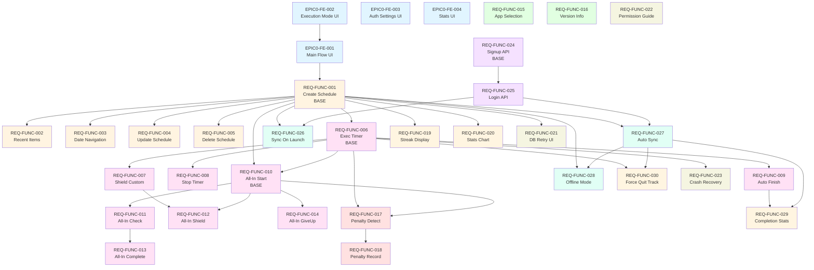
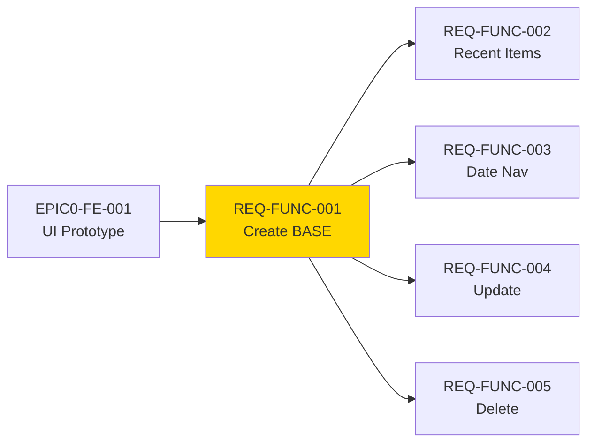
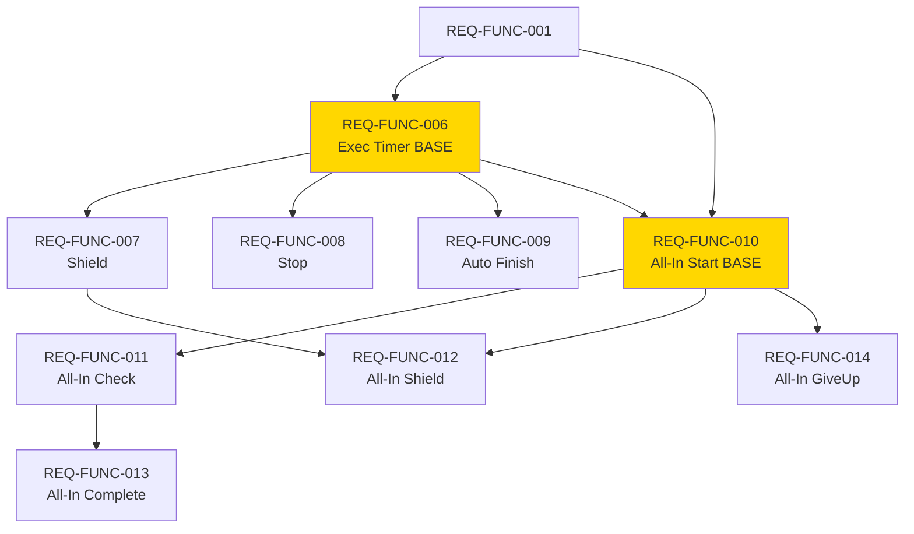
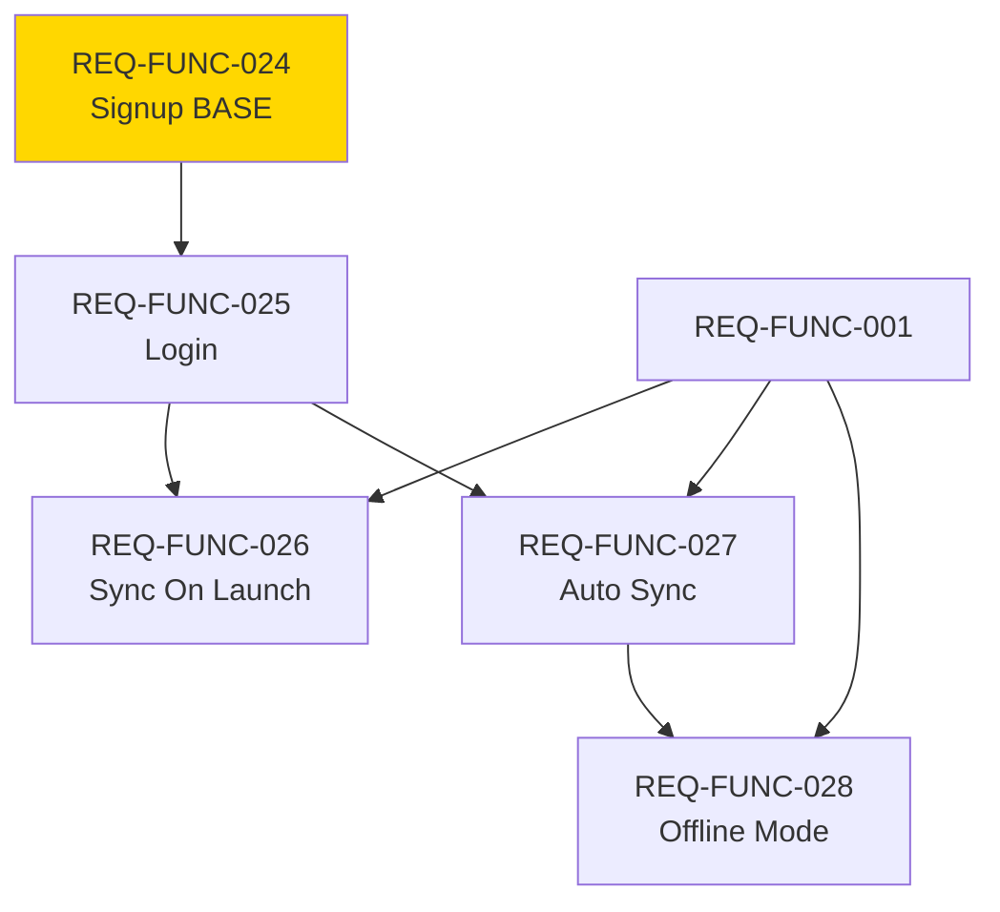

# 통합 WBS 및 DAG (Work Breakdown Structure & Directed Acyclic Graph)

## 개요

본 문서는 Unwind 프로젝트의 모든 Task 정의서를 기반으로 작성된 **통합 작업 분해 구조(WBS)**와 **의존성 그래프(DAG)**를 제공합니다. 이를 통해 프로젝트의 전체 구조와 구현 순서를 시각적으로 파악할 수 있습니다.

## 1. WBS (Work Breakdown Structure)

### 1.1 Epic 계층 구조

```
Unwind Project
├── EPIC_0_FE_PROTOTYPE (프론트엔드 PoC)
│   ├── EPIC0-FE-001: 스케줄 홈 및 CRUD UI 프로토타입
│   ├── EPIC0-FE-002: 집중 모드 실행 및 Shield 화면 시뮬레이션
│   ├── EPIC0-FE-003: 설정, 인증 및 페널티 UI 프로토타입
│   └── EPIC0-FE-004: 통계 대시보드 및 스트릭 UI
│
├── EPIC_1_SCHEDULE (스케줄 관리)
│   ├── REQ-FUNC-001: 스케줄 생성 기능 구현 [Base]
│   ├── REQ-FUNC-002: 최근 항목 빠른 추가 기능 구현
│   ├── REQ-FUNC-003: 7일 날짜 탭 내비게이션 구현
│   ├── REQ-FUNC-004: 스케줄 수정 기능 구현
│   └── REQ-FUNC-005: 스케줄 삭제 기능 구현
│
├── EPIC_2_FOCUS_MODE (집중 모드)
│   ├── REQ-FUNC-006: 개별 스케줄 실행 및 타이머 구현 [Base]
│   ├── REQ-FUNC-007: Shield 화면 커스터마이징 구현
│   ├── REQ-FUNC-008: 개별 스케줄 수동 정지 기능 구현
│   ├── REQ-FUNC-009: 타이머 완료 시 자동 완료 처리 구현
│   ├── REQ-FUNC-010: 올인 모드 시작 기능 구현 [Base]
│   ├── REQ-FUNC-011: 올인 모드 중 개별 스케줄 완료 체크 기능 구현
│   ├── REQ-FUNC-012: 올인 모드용 Shield 화면 커스터마이징 구현
│   ├── REQ-FUNC-013: 올인 모드 전체 완료 감지 및 해제 구현
│   └── REQ-FUNC-014: 올인 모드 중단 및 실패 기록 구현
│
├── EPIC_3_SETTINGS (설정)
│   ├── REQ-FUNC-015: 차단할 앱 선택 기능 구현
│   └── REQ-FUNC-016: 앱 버전 정보 표시 구현
│
├── EPIC_4_ANTI_CHEAT (우회 방지)
│   ├── REQ-FUNC-017: 권한 해제 감지 및 사유 입력 강제 구현
│   └── REQ-FUNC-018: 권한 해제 사유 기록 및 실패 처리 구현
│
├── EPIC_5_AUTH (인증)
│   ├── REQ-FUNC-024: 사용자 회원가입 백엔드 API 구현 [Base]
│   └── REQ-FUNC-025: 사용자 로그인 백엔드 API 구현
│
├── EPIC_6_SYNC (동기화)
│   ├── REQ-FUNC-026: 앱 실행 시 스케줄 데이터 동기화 구현
│   ├── REQ-FUNC-027: 스케줄 변경 시 자동 동기화 구현
│   └── REQ-FUNC-028: 오프라인 모드 지원 구현
│
├── EPIC_7_STATS (통계)
│   ├── REQ-FUNC-019: 스트릭 표시 기능 구현
│   ├── REQ-FUNC-020: 주간/월간 통계 그래프 구현
│   ├── REQ-FUNC-029: 스케줄 완료 통계 데이터 서버 전송 구현
│   └── REQ-FUNC-030: 앱 강제 종료 횟수 추적 및 전송 구현
│
└── EPIC_8_STABILITY (안정성)
    ├── REQ-FUNC-021: 데이터베이스 쓰기 실패 재시도 UI 구현
    ├── REQ-FUNC-022: Screen Time 권한 거부 안내 구현
    └── REQ-FUNC-023: 타이머 실행 중 크래시 복구 기능 구현
```

### 1.2 구현 단계별 그룹화

#### Phase 0: 프로토타입 (독립 실행 가능)
- EPIC0-FE-001 ~ EPIC0-FE-004

#### Phase 1: 핵심 데이터 모델 및 CRUD (기반 구축)
- REQ-FUNC-001 [Base]
- REQ-FUNC-002 ~ REQ-FUNC-005 (REQ-FUNC-001 의존)

#### Phase 2: 집중 모드 핵심 기능
- REQ-FUNC-006 [Base] (REQ-FUNC-001 의존)
- REQ-FUNC-007 ~ REQ-FUNC-009 (REQ-FUNC-006 의존)
- REQ-FUNC-010 [Base] (REQ-FUNC-001, REQ-FUNC-006 의존)
- REQ-FUNC-011 ~ REQ-FUNC-014 (REQ-FUNC-010 의존)

#### Phase 3: 백엔드 인증 (독립 실행 가능)
- REQ-FUNC-024 [Base]
- REQ-FUNC-025 (REQ-FUNC-024 의존)

#### Phase 4: 동기화 엔진
- REQ-FUNC-026 ~ REQ-FUNC-028 (REQ-FUNC-001, REQ-FUNC-025 의존)

#### Phase 5: 통계 및 부가 기능
- REQ-FUNC-019 ~ REQ-FUNC-020 (REQ-FUNC-001 의존)
- REQ-FUNC-029 ~ REQ-FUNC-030 (다양한 의존성)
- REQ-FUNC-015 ~ REQ-FUNC-018 (독립 또는 부분 의존)
- REQ-FUNC-021 ~ REQ-FUNC-023 (부분 의존)

## 2. DAG (Directed Acyclic Graph) - 의존성 그래프

### 2.1 전체 의존성 그래프



### 2.2 Epic별 의존성 그래프

#### Epic 1: Schedule Management



#### Epic 2: Focus Mode



#### Epic 5 & 6: Auth & Sync



## 3. 구현 순서 및 병렬 실행 전략

### 3.1 즉시 실행 가능한 Task (의존성 없음)

다음 Task들은 의존성이 없어 즉시 시작할 수 있습니다:

- **EPIC0-FE-001**: 스케줄 홈 및 CRUD UI 프로토타입
- **EPIC0-FE-003**: 설정, 인증 및 페널티 UI 프로토타입
- **EPIC0-FE-004**: 통계 대시보드 및 스트릭 UI
- **REQ-FUNC-015**: 차단할 앱 선택 기능 구현
- **REQ-FUNC-016**: 앱 버전 정보 표시 구현
- **REQ-FUNC-022**: Screen Time 권한 거부 안내 구현
- **REQ-FUNC-024**: 사용자 회원가입 백엔드 API 구현

### 3.2 단계별 구현 로드맵

#### Sprint 0: 프로토타입 (1-2주)
```
EPIC0-FE-001 → EPIC0-FE-002
EPIC0-FE-003 (병렬)
EPIC0-FE-004 (병렬)
```

#### Sprint 1: 핵심 데이터 모델 (1주)
```
EPIC0-FE-001 완료 후:
REQ-FUNC-001 → REQ-FUNC-002, REQ-FUNC-003, REQ-FUNC-004, REQ-FUNC-005 (병렬)
```

#### Sprint 2: 집중 모드 기본 기능 (2주)
```
REQ-FUNC-001 완료 후:
REQ-FUNC-006 → REQ-FUNC-007, REQ-FUNC-008, REQ-FUNC-009 (병렬)
```

#### Sprint 3: 올인 모드 (1주)
```
REQ-FUNC-001, REQ-FUNC-006 완료 후:
REQ-FUNC-010 → REQ-FUNC-011 → REQ-FUNC-013
REQ-FUNC-010 → REQ-FUNC-014 (병렬)
REQ-FUNC-007, REQ-FUNC-010 완료 후:
REQ-FUNC-012
```

#### Sprint 4: 백엔드 인증 (1주)
```
REQ-FUNC-024 → REQ-FUNC-025
(프론트엔드와 병렬 개발 가능)
```

#### Sprint 5: 동기화 엔진 (2주)
```
REQ-FUNC-001, REQ-FUNC-025 완료 후:
REQ-FUNC-026, REQ-FUNC-027 (병렬) → REQ-FUNC-028
```

#### Sprint 6: 통계 및 부가 기능 (1-2주)
```
REQ-FUNC-001 완료 후:
REQ-FUNC-019, REQ-FUNC-020 (병렬)

REQ-FUNC-009, REQ-FUNC-027 완료 후:
REQ-FUNC-029

REQ-FUNC-006, REQ-FUNC-027 완료 후:
REQ-FUNC-030

REQ-FUNC-006, REQ-FUNC-010 완료 후:
REQ-FUNC-017 → REQ-FUNC-018

REQ-FUNC-001 완료 후:
REQ-FUNC-021 (병렬)

REQ-FUNC-006 완료 후:
REQ-FUNC-023
```

### 3.3 크리티컬 패스 (Critical Path)

가장 긴 의존성 체인으로, 프로젝트 완료 시간을 결정합니다:

```
EPIC0-FE-001 
  → REQ-FUNC-001 
    → REQ-FUNC-006 
      → REQ-FUNC-010 
        → REQ-FUNC-011 
          → REQ-FUNC-013
```

**예상 기간**: 약 6-8주 (각 Sprint가 1-2주 가정)

### 3.4 병렬 실행 가능 영역

다음 Task들은 서로 독립적이거나 공통 의존성만 있어 병렬 실행이 가능합니다:

1. **REQ-FUNC-002, REQ-FUNC-003, REQ-FUNC-004, REQ-FUNC-005** (모두 REQ-FUNC-001 의존)
2. **REQ-FUNC-007, REQ-FUNC-008, REQ-FUNC-009** (모두 REQ-FUNC-006 의존)
3. **REQ-FUNC-019, REQ-FUNC-020, REQ-FUNC-021** (모두 REQ-FUNC-001 의존)
4. **REQ-FUNC-026, REQ-FUNC-027** (공통 의존성: REQ-FUNC-001, REQ-FUNC-025)

## 4. Task 우선순위 매트릭스

| 우선순위 | Task ID | 이유 |
|---------|---------|------|
| **P0 (Must)** | REQ-FUNC-001 | 모든 기능의 기반이 되는 데이터 모델 |
| **P0 (Must)** | REQ-FUNC-006 | 핵심 기능인 집중 모드의 기반 |
| **P0 (Must)** | REQ-FUNC-024 | 백엔드 인증의 기반 |
| **P1 (Must)** | REQ-FUNC-002~005 | 스케줄 CRUD 완성 |
| **P1 (Must)** | REQ-FUNC-007~009 | 개별 실행 기능 완성 |
| **P1 (Must)** | REQ-FUNC-010~014 | 올인 모드 기능 완성 |
| **P1 (Must)** | REQ-FUNC-025~028 | 동기화 기능 완성 |
| **P2 (Should)** | REQ-FUNC-015~018 | 설정 및 우회 방지 |
| **P2 (Should)** | REQ-FUNC-019~020 | 통계 UI |
| **P2 (Should)** | REQ-FUNC-029~030 | 통계 전송 |
| **P3 (Could)** | REQ-FUNC-021~023 | 예외 처리 및 안정성 |

## 5. 리스크 및 병목 지점

### 5.1 높은 의존성을 가진 Task (병목 가능)

- **REQ-FUNC-001**: 13개 Task가 의존 (가장 중요한 기반)
- **REQ-FUNC-006**: 7개 Task가 의존 (집중 모드의 핵심)
- **REQ-FUNC-010**: 4개 Task가 의존 (올인 모드의 핵심)
- **REQ-FUNC-025**: 3개 Task가 의존 (동기화의 전제 조건)

### 5.2 복잡한 의존성 체인

다음 체인은 순차 실행이 필수이므로 주의가 필요합니다:

1. **REQ-FUNC-010 → REQ-FUNC-011 → REQ-FUNC-013** (올인 모드 완료 플로우)
2. **REQ-FUNC-017 → REQ-FUNC-018** (패널티 처리 플로우)
3. **REQ-FUNC-024 → REQ-FUNC-025 → REQ-FUNC-026/027** (인증 → 동기화)

## 6. 활용 방법

### 6.1 스프린트 계획 시

1. **의존성 그래프 확인**: 현재 Sprint에서 실행 가능한 Task 식별
2. **병렬 실행 계획**: 독립적인 Task를 여러 에이전트에게 동시 할당
3. **크리티컬 패스 모니터링**: 지연 시 전체 일정에 영향이 큰 Task 우선 관리

### 6.2 에이전트 오케스트레이션 시

1. **Ready Queue 생성**: `dependencies`가 모두 완료된 Task만 Ready 상태로 표시
2. **에이전트 라우팅**: `agent_profile` 필드를 확인하여 적절한 에이전트에게 할당
3. **병렬 실행**: `parallelizable: true`인 Task는 동시에 여러 에이전트에게 할당 가능

### 6.3 진행 상황 추적 시

1. **완료된 Task 체크**: 의존성 그래프에서 완료된 노드를 제거
2. **다음 실행 가능 Task 식별**: 남은 노드 중 의존성이 모두 해소된 것 찾기
3. **블로커 식별**: 진행이 지연되어 다른 Task를 막고 있는 Task 찾기

---

**문서 버전**: 1.0  
**최종 업데이트**: 2025-01-XX  
**관련 문서**: [AI_AGENT_TASKS_USAGE_GUIDE.md](./AI_AGENT_TASKS_USAGE_GUIDE.md)

